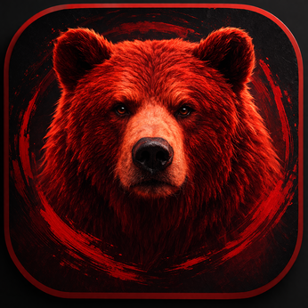

<p align="center">

</p>

<h1 align="center">Red Bear OS</h1>

<p align="center">
<strong>Microkernel operating system in Rust — based on <a href="https://www.redox-os.org">Redox OS</a></strong>
</p>

<p align="center">
<a href="./LICENSE"></a>


</p>

---

Red Bear OS is a derivative of [Redox OS](https://www.redox-os.org) — a general-purpose, Unix-like, microkernel-based operating system written in Rust. It tracks upstream Redox, incorporating its improvements while adding custom drivers, filesystems, and hardware support.

RedBearOS should be understood as an overlay distribution on top of Redox in the same way Ubuntu
relates to Debian:

- Redox is upstream
- Red Bear carries integration, packaging, validation, and subsystem overlays on top
- upstream-owned source trees are refreshable working copies
- durable Red Bear state belongs in `local/patches/`, `local/recipes/`, `local/docs/`, and tracked
  Red Bear configs

For **upstream WIP recipes specifically**, Red Bear uses a stricter rule:

1. once an upstream recipe or subsystem is still marked WIP, Red Bear treats it as a local project
2. we copy, fix, validate, and ship that work from our local overlay until it is stable enough for us
3. we continue updating our local copy from upstream WIP work when useful, but we do not rely on the
   upstream WIP recipe itself as our shipped source of truth
4. once upstream removes the WIP status and the recipe/subsystem becomes a first-class supported
   part of Redox, Red Bear reevaluates and should prefer the upstream version over the local copy

That policy exists so the project can pull refreshed upstream sources regularly and still rebuild
predictably from the Red Bear-owned overlay.

## What's New

- KDE bring-up moved forward: `config/redbear-kde.toml` exists, the Qt6 stack builds in-tree, and the KDE recipe tree is now populated.
- Native Red Bear runtime tooling expanded with `redbear-info`, `redbear-hwutils` (`lspci`, `lsusb`), and a Redox-native `netctl` flow.
- Build and status docs were refreshed to distinguish current in-tree progress from older historical roadmap text.

See [CHANGELOG.md](./CHANGELOG.md) for the running user-visible change log.

The current public roadmap and execution model live in the
[Red Bear OS Implementation Plan](./docs/07-RED-BEAR-OS-IMPLEMENTATION-PLAN.md).

For readers landing on GitHub, the most useful entry points are:

- [Documentation Index](./docs/README.md) — canonical map of current vs historical docs
- [Console to KDE Desktop Plan](./local/docs/CONSOLE-TO-KDE-DESKTOP-PLAN.md) — canonical path from console boot to hardware-accelerated KDE Plasma on Wayland
- [Desktop Stack Current Status](./local/docs/DESKTOP-STACK-CURRENT-STATUS.md) — current build/runtime truth for Qt, Wayland, and KDE surfaces
- [WIP Migration Ledger](./local/docs/WIP-MIGRATION-LEDGER.md) — how Red Bear currently treats upstream WIP versus local overlays
- [Script Behavior Matrix](./local/docs/SCRIPT-BEHAVIOR-MATRIX.md) — what the main sync/fetch/apply/build scripts do and do not guarantee

Current subsystem-specific plans also include:

- [USB Implementation Plan](./local/docs/USB-IMPLEMENTATION-PLAN.md)
- [Wi-Fi Implementation Plan](./local/docs/WIFI-IMPLEMENTATION-PLAN.md)
- [Bluetooth Implementation Plan](./local/docs/BLUETOOTH-IMPLEMENTATION-PLAN.md)
- [IRQ and Low-Level Controllers Enhancement Plan](./local/docs/IRQ-AND-LOWLEVEL-CONTROLLERS-ENHANCEMENT-PLAN.md)

Red Bear OS now treats AMD and Intel machines as equal-priority hardware targets. Older AMD-first
language in historical integration notes should be read as earlier sequencing context, not as the
current platform policy.

## Historical Phase Snapshot

The table below is a legacy P0-P6 snapshot retained for historical continuity with older Red Bear
status notes.

It is **not** the canonical execution-order source for current subsystem planning. For the current
repo-wide order of implementation — including low-level controllers, USB, Wi‑Fi, and Bluetooth as
first-class subsystem workstreams — use
[docs/07-RED-BEAR-OS-IMPLEMENTATION-PLAN.md](./docs/07-RED-BEAR-OS-IMPLEMENTATION-PLAN.md) together
with the subsystem plans listed above.

| Phase | Status | Notes |
|---|---|---|
| P0 ACPI boot | ✅ Complete | In-tree and documented in `local/docs/ACPI-FIXES.md` |
| P1 driver infra | ✅ Complete | Compile-oriented infrastructure present |
| P2 DRM / display | ✅ Code complete | Hardware validation still pending |
| P3 POSIX + input | 🚧 In progress | relibc exports now cover the rebuilt `signalfd`/`timerfd`/`eventfd`/`open_memstream` consumer path; runtime validation remains |
| P4 Wayland runtime | 🚧 In progress | `redbear-wayland` is now a first-class profile, builds to a bootable image, and reaches the `orbital-wayland` → `smallvil` runtime path in QEMU/UEFI |
| P5 desktop/network plumbing | 🚧 In progress | `redbear-full` now carries the native VirtIO networking path plus D-Bus system-bus plumbing, and the guest-side runtime check reaches `DBUS_SYSTEM_BUS=present` |
| P6 KDE Plasma | 🚧 In progress | Mix of real builds, shims, and stubs |

There is no distinct first-class **P7** artifact in this older historical numbering. The canonical
current execution plan uses the newer phased/workstream ordering documented in `docs/07`.

## First-class subsystem order and blockers

The current subsystem order is not arbitrary.

- **Low-level controllers / IRQ quality** are first-class because they block reliable driver/runtime validation.
- **USB** is first-class because Bluetooth and wider device support depend on controller and hotplug maturity.
- **Wi-Fi** is first-class because Red Bear still lacks any native wireless driver/control plane.
- **Bluetooth** is first-class because broad support is still incomplete, depends on USB maturity or
  another controller path, and currently exists only as one bounded BLE-first experimental slice
  rather than broad desktop parity.

The current blocker chain is:

`low-level controllers -> USB -> Bluetooth`

and, separately:

`low-level controllers -> Wi-Fi driver bring-up -> native wireless control plane -> desktop compatibility later`

These subsystems are all intended to be implemented in full, but they must be executed in this order
to avoid building desktop-facing layers on top of missing runtime substrate.

The current total order is: low-level controllers first, then USB, then Wi-Fi, then Bluetooth, and
only after those runtime services are credible should heavier desktop/session compatibility layers
expand on top of them.

## What's Different from Upstream Redox

| Component | Status | Detail |
|-----------|--------|--------|
| AMD GPU driver (amdgpu) | ✅ Compiles | LinuxKPI compat + AMD DC modesetting + MSI-X (no HW validation) |
| Intel GPU driver | ✅ Compiles | Display pipe modesetting + MSI-X (no HW validation) |
| ext4 filesystem | ✅ Compiles | Read/write ext4 alongside RedoxFS |
| ACPI for AMD bare metal | ✅ Complete | x2APIC, MADT, FADT shutdown/reboot, power methods |
| Wired networking | 🚧 Improved | native net stack present, Redox-native `netctl` shipped, RTL8125 autoload wired through the existing Realtek path |
| Custom branding | ✅ | Boot identity, hostname, os-release |
| POSIX gaps (relibc) | 🚧 In progress | implementations exist in-tree; runtime validation against Wayland stack is still ongoing |

## Project Structure

```
├── config/           # Build configs (TOML) — desktop, minimal, redbear-*
├── recipes/          # Package recipes (~100+ packages, 26 categories)
├── mk/               # Makefile build orchestration
├── src/              # Cookbook Rust tool (repo binary, cook logic)
├── local/            # ← Red Bear OS custom work (survives upstream updates)
│   ├── patches/      #   Kernel, base, relibc patches
│   ├── recipes/      #   Custom packages (drivers, GPU, system, branding)
│   ├── scripts/      #   sync-upstream.sh, apply-patches.sh
│   ├── Assets/       #   Branding (icon, boot background)
│   └── docs/         #   Integration documentation
├── docs/             # Architecture guides
├── scripts/          # Helper scripts
└── Makefile          # Root build orchestrator
```

## Build

Requires a Linux x86_64 host with Rust nightly, QEMU, and standard build tools. See the [Redox Build Instructions](https://doc.redox-os.org/book/podman-build.html) for full prerequisites.

```bash
make all CONFIG_NAME=redbear-full        # Full desktop + custom drivers
make all CONFIG_NAME=redbear-minimal     # Minimal server
make live CONFIG_NAME=redbear-full       # Live ISO (redbear-live.iso)
make qemu                                # Boot in QEMU
```

## Native hardware listing tools

Red Bear configs now include a small native `redbear-hwutils` package that ships `lspci` and
`lsusb`. `lspci` reads the existing `/scheme/pci/.../config` surface, while `lsusb` walks the
native `usb.*` schemes exposed by `xhcid`, so there is no dependency on the unfinished WIP
`pciutils` or `usbutils` ports.

## Networking

Red Bear ships the existing native Redox wired networking path (`pcid-spawner` → NIC daemon →
`smolnetd`/`dhcpd`/`netcfg`) together with a small Redox-native `netctl` compatibility command and
the `redbear-netctl-console` ncurses client for the bounded Wi‑Fi profile flow. Profiles live under
`/etc/netctl`, the shipped examples live under `/etc/netctl/examples`, live Wi‑Fi actions go
through `/scheme/wifictl`, and the boot service applies the enabled profile with `netctl --boot`.

RTL8125 is wired into the existing native Realtek autoload path by matching `10ec:8125` in the
`rtl8168d` driver config. This keeps the implementation in the Redox userspace driver model rather
than introducing a separate Linux netdevice compatibility layer.

## Runtime diagnostics

Red Bear ships `redbear-info` as the canonical runtime integration/debugging command. It is a
passive report over live system surfaces and is intended to help answer questions like:

- which Red Bear integrations are merely installed versus actually active,
- whether the networking stack is up, with current IP, DNS, and default route,
- whether hardware discovery surfaces such as PCI, USB, DRM, and RTL8125 are visible.

Use `redbear-info --verbose` for evidence-backed human output, `redbear-info --json` for machine-
readable diagnostics, and `redbear-info --test` for suggested follow-up commands.

## Sync with Upstream Redox

```bash
./local/scripts/sync-upstream.sh              # Rebase onto latest Redox
./local/scripts/sync-upstream.sh --dry-run    # Preview conflicts first
```

The `local/` directory is never touched by upstream updates. Recipe patches for kernel and base are symlinked from `local/patches/` — protected from `make clean` and `make distclean`.

## Resources

- [Upstream Redox website](https://www.redox-os.org)
- [Redox Book](https://doc.redox-os.org/book/)
- [Hardware Support](https://doc.redox-os.org/book/hardware-support.html)
- [Contributing](CONTRIBUTING.md)

## AI Policy

We welcome contributions made with the assistance of LLMs and AI tools. If you use AI to help write code, documentation, or patches, that's great — we care about the quality of the result, not how it was produced.

## License

[MIT](./LICENSE) — same as upstream Redox OS.
